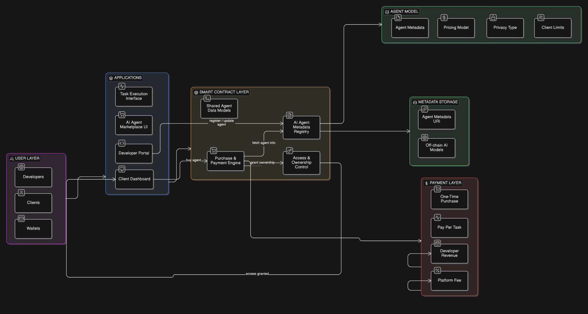

# DARC - Contract structure



## MetadataURI

`example uri -> ipfs://abc123/agent1.json`

```json
{
  "name": "Deep Learning Code Assistant",
  "description": "AI agent that helps write and debug ML code.",
  "developer": "0x123...",
  "version": "1.0",
  "type": "public",
  "price": "5 AVAX",
  "model": "Llama 3",
  "capabilities": [
    "code generation",
    "model training",
    "debugging"
  ],
  "endpoint": "https://api.myagent.ai/run",
  "logo": "ipfs://img123/logo.png"
}
```